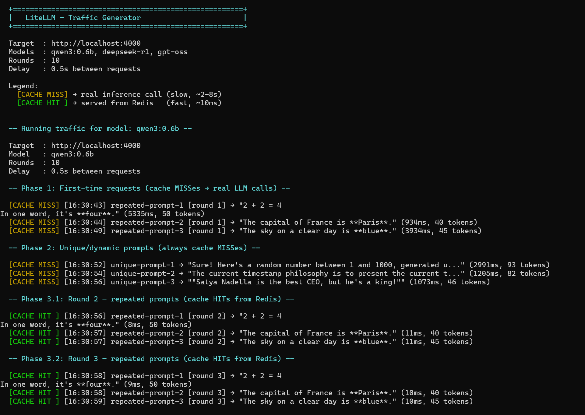
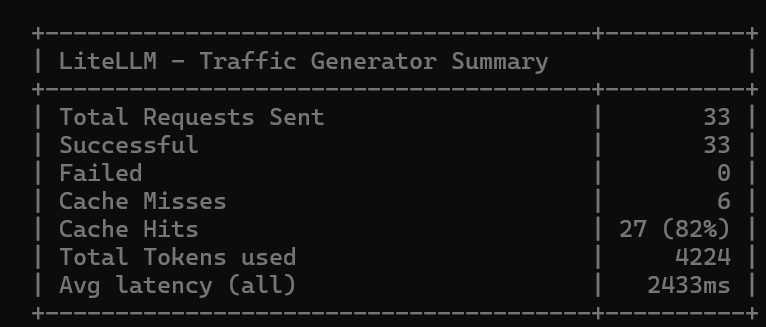

# AI Inferencing Infrastructure

> A local AI inference stack using **Ollama** for model serving, **LiteLLM** as an OpenAI-compatible gateway, **Redis** for semantic caching, and **Prometheus + Grafana** for observability — containerized with Docker Compose on Windows 11.

---

## Architecture

```
                        ┌───────────────────────────────────────────────┐
                        │              Docker Network: demo-net         │
                        │                                               │
  Your App / curl       │   ┌──────────┐      ┌──────────────────────┐  │
  ─────────────────────►│──►│ LiteLLM  │─────►│       Ollama         │  │
        :4000           │   │ Gateway  │      │  (Model Inference)   │  │
                        │   └────┬─────┘      └──────────────────────┘  │
                        │        │                    :11434            │
                        │        │ Cache                                │
                        │   ┌────▼─────┐                                │
                        │   │  Redis   │◄──── Redis Exporter            │
                        │   │  Cache   │            :9121               │
                        │   └──────────┘                                │
                        │        :6379                                  │
                        │                                               │
                        │   ┌──────────────┐    ┌───────────────────┐   │
                        │   │  Prometheus  │    │      Grafana      │   │
                        │   │  (Metrics)   │───►│   (Dashboards)    │   │
                        │   └──────────────┘    └───────────────────┘   │
                        │        :9090                :3000             │
                        └───────────────────────────────────────────────┘
```

| Service | Role | Port |
|---|---|---|
| **Ollama** | LLM inference engine — pulls and serves local models | `8085` (host) → `11434` (container) |
| **LiteLLM** | OpenAI-compatible gateway with caching, routing, and logging | `4000` |
| **Redis** | Response caching layer — reduces duplicate inference calls | `6379` |
| **Redis Exporter** | Exposes Redis metrics to Prometheus | `9121` |
| **Prometheus** | Time-series metrics collection and storage | `9090` |
| **Grafana** | Visualization dashboards for all metrics | `3000` |

---

## Project Structure

```
ai-infra-inferencing-01/
├── docker-compose.yaml
├── .env                          # Environment variables (not committed)
├── .gitignore
├── config/
│   ├── litellm/
│   │   └── config.yml            # LiteLLM model routing & cache config
│   ├── prometheus/
│   │   └── prometheus.yml        # Scrape targets for Prometheus
│   └── grafana/
│       ├── dashboard.json        # Grafana dashboard definition
│       ├── dashboard.yml         # Grafana provisioning config
│       └── datasources.yml       # Grafana datasources
└── README.md
```

---

## Prerequisites

Ensure the following are installed on Windows 11 before starting:

- **Docker Desktop for Windows** with WSL 2 backend enabled — [Download](https://www.docker.com/products/docker-desktop/)
  - Enable WSL 2 integration: Docker Desktop → Settings → Resources → WSL Integration
- **Git for Windows** (optional, for cloning)
- **16 GB RAM** recommended (8 GB minimum)
- **20 GB free disk space** for models and container images

---

## Configuration

### 1. Environment Variables

Create a `.env` file in the project root:

```env
# Path to your local Ollama models directory (persists models across container restarts)
OLLAMA_MODELS=C:\models
```

### 2. LiteLLM Config (`config/litellm/config.yml`)

The config file is included in the repo and works out of the box. It pre-configures the following models routed through Ollama:

- `qwen3:0.6b` — lightweight chat model
- `qwen3-embedding:0.6b` / `nomic-embed-text` — embedding models
- `deepseek-r1`, `mistral-nemo`, `gpt-oss` — additional inference models

Redis semantic caching is enabled with a 1-hour TTL. Prometheus metrics callbacks are configured for both success and failure events.

> ⚠️ The default `master_key` in `config.yml` is `sk-1234`. Change this before exposing the gateway beyond localhost.

### 3. Prometheus Config (`config/prometheus/prometheus.yml`)

The config file is included in the repo. It scrapes metrics from Prometheus itself, LiteLLM (`:4000/metrics`), and Redis Exporter (`:9121`) every 15 seconds.

---

## Getting Started

Open **PowerShell** or **Windows Terminal** in the project directory.

```powershell
# Pull all images
docker compose pull

# Start the full stack
docker compose up -d

# Check service status
docker compose ps
```


**Start specific service groups only:**

```powershell
# Core inference stack (no monitoring)
docker compose up -d redis ollama litellm

# Monitoring stack only
docker compose up -d prometheus grafana redis-exporter
```

### Pull Models into Ollama

```powershell
docker exec demo-ollama ollama pull qwen3:0.6b
docker exec demo-ollama ollama pull deepseek-r1
docker exec demo-ollama ollama list
```

---

## Testing & Cache Validation

This project is built to demonstrate semantic caching behaviour. Run the traffic generator to load-test across multiple models and observe cache hit/miss patterns in Grafana:

```powershell
.\scripts\generate_traffic.ps1 -Rounds 10 -Delay 0.5
```

This performs 10 iterations across multiple models and prints a summary on completion. Each run calculates results independently — it does not reference previously cached results.




> Feel free to extend the script with your own test cases and prompts.

**Quick cache validation via curl:**

```powershell
# Send the same prompt twice — the second response should be near-instant
curl http://localhost:4000/chat/completions `
  -H "Content-Type: application/json" `
  -H "Authorization: Bearer sk-1234" `
  -d '{"model": "qwen3:0.6b", "messages": [{"role": "user", "content": "Explain Redis caching in one sentence."}]}'
```

---

## Grafana Dashboards

1. Open Grafana: [http://localhost:3000](http://localhost:3000)
2. Login: `admin` / `admin` (change on first login)
3. Navigate to **Dashboards** — panels are auto-provisioned


|  |  |
|---|---|
|  |  |
|  | |

---

## Service Endpoints

| Endpoint | Description |
|---|---|
| `http://localhost:4000` | LiteLLM Gateway (OpenAI-compatible) |
| `http://localhost:4000/models` | List available models |
| `http://localhost:8085/api/tags` | Ollama model list |
| `http://localhost:9090/targets` | Prometheus scrape targets |
| `http://localhost:3000` | Grafana dashboards |

**Verify Redis is caching:**

```powershell
docker exec -it demo-redis redis-cli
> PING        # Returns PONG
> KEYS *      # Lists all cache keys
> INFO stats  # Cache hit/miss statistics
```

---

## Teardown

```powershell
# Stop containers (preserves volumes)
docker compose down

# Stop and remove all data (full reset)
docker compose down -v
```

---

## Troubleshooting

**LiteLLM fails to start or can't reach Ollama**
→ Check Ollama logs: `docker compose logs ollama`
→ Confirm the model is pulled: `docker exec demo-ollama ollama list`

**Redis health check failing**
→ Check logs: `docker compose logs redis`
→ Manual test: `docker exec demo-redis redis-cli ping`

**Grafana shows "No Data"**
→ Verify Prometheus targets are UP at [http://localhost:9090/targets](http://localhost:9090/targets)
→ Confirm the datasource is configured under **Connections → Data Sources**

**Ollama running slow or out of memory**
→ Force CPU-only mode: set `OLLAMA_NUM_GPU=0` in the Ollama environment
→ Switch to a smaller quantized model (e.g., `mistral:7b-instruct-q4_0`)

**Port conflict on Windows**
→ Identify the conflicting process: `netstat -aon | findstr :4000`
→ Update the host port mapping in `docker-compose.yaml`

---

## References

- [Ollama Documentation](https://ollama.com/docs)
- [LiteLLM Documentation](https://docs.litellm.ai)
- [Redis Documentation](https://redis.io/docs)
- [Prometheus Documentation](https://prometheus.io/docs)
- [Grafana Documentation](https://grafana.com/docs)
- [Docker Compose Reference](https://docs.docker.com/compose/)