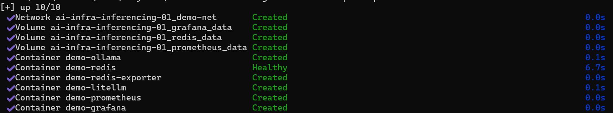
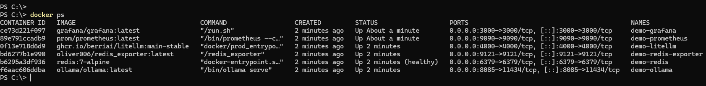
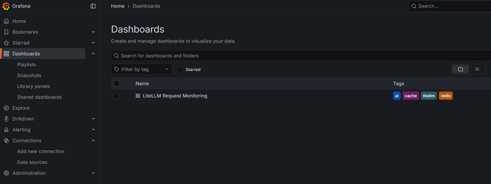
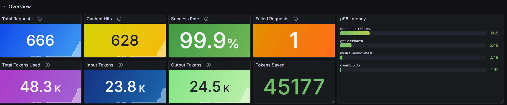
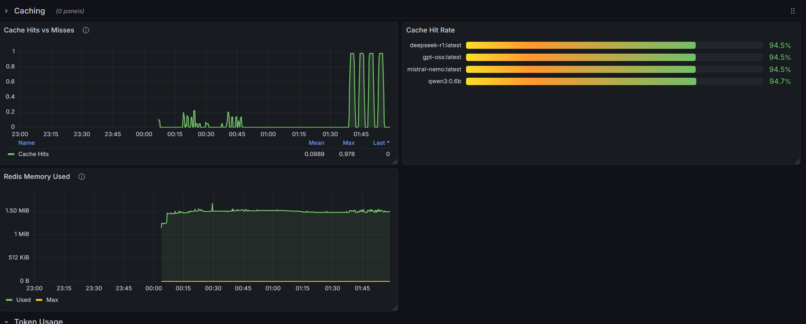
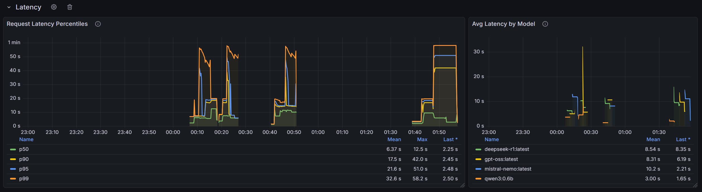
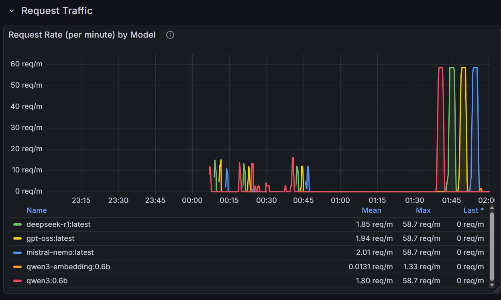
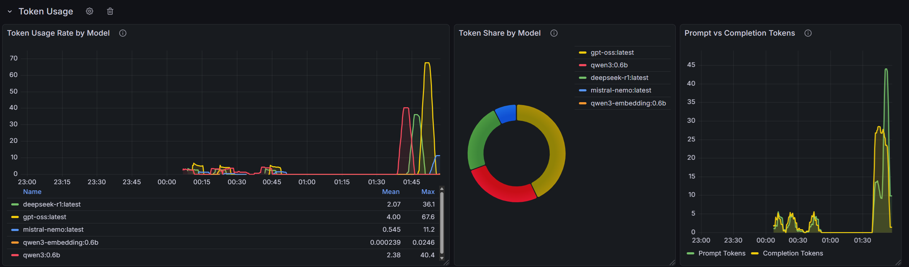
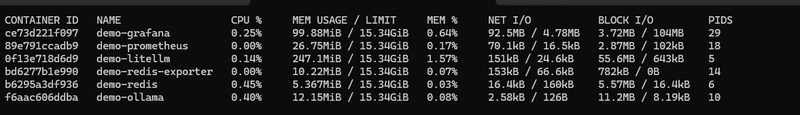

# 🤖 AI Inferencing Infrastructure

> Local AI inference stack using **Ollama** for model serving, **LiteLLM** as an OpenAI-compatible AI gateway, **Redis** for semantic caching, and **Prometheus + Grafana** for monitoring and observability — all containerized with Docker Compose on Windows 11.

 ***ReadMe is Generated using Claude Code, verify***

---

## 📐 Architecture Overview

```
                        ┌───────────────────────────────────────────────┐
                        │              Docker Network: demo-net         │
                        │                                               │
  Your App / curl       │   ┌──────────┐      ┌──────────────────────┐  │
  ─────────────────────►│──►│ LiteLLM  │─────►│       Ollama         │  │
        :4000           │   │ Gateway  │      │  (Model Inference)   │  │
                        │   └────┬─────┘      └──────────────────────┘  │
                        │        │                    :11434            │
                        │        │ Cache                                │
                        │   ┌────▼─────┐                                │
                        │   │  Redis   │◄──── Redis Exporter            │
                        │   │  Cache   │            :9121               │
                        │   └──────────┘                                │
                        │        :6379                                  │
                        │                                               │
                        │   ┌──────────────┐    ┌───────────────────┐   │
                        │   │  Prometheus  │    │      Grafana      │   │
                        │   │  (Metrics)   │───►│   (Dashboards)    │   │
                        │   └──────────────┘    └───────────────────┘   │
                        │        :9090                :3000             │
                        └───────────────────────────────────────────────┘
```

| Service | Role | Port |
|---|---|---|
| **Ollama** | LLM inference engine — pulls and serves local models | `8085` (host) → `11434` (container) |
| **LiteLLM** | OpenAI-compatible AI gateway with caching, routing, and logging | `4000` |
| **Redis** | Response caching layer — reduces duplicate inference calls | `6379` |
| **Redis Exporter** | Exposes Redis metrics to Prometheus | `9121` |
| **Prometheus** | Time-series metrics collection and storage | `9090` |
| **Grafana** | Visualization dashboards for all metrics | `3000` |

---

## 🗂️ Project Structure

```
ai-infra-inferencing-01/
├── docker-compose.yaml
├── .env                          # Environment variables (not committed)
├── .gitignore
├── config/
│   ├── litellm/
│   │   └── config.yml            # LiteLLM model routing & cache config
│   ├── prometheus/
│   │   └── prometheus.yml        # Scrape targets for Prometheus
│   └── grafana/
│       ├── dashboard.json         # Grafana Dashboard
│       └── dashboard.yml          # Grafana Privisioing Config
│       ├── datasources.yml        # Grafana Datasources
└── README.md
```

---

## ✅ Prerequisites

Before spinning up the stack, ensure you have the following installed on Windows 11:

- **Docker Desktop for Windows** (with WSL 2 backend enabled)
  - Download: https://www.docker.com/products/docker-desktop/
  - Enable WSL 2 integration in Docker Desktop → Settings → Resources → WSL Integration
- **Git for Windows** (optional, for cloning)
- At least **16 GB RAM** recommended (8 GB minimum)
- At least **20 GB free disk space** for models and container images

---

## ⚙️ Configuration

### 1. Environment Variables

Create a `.env` file in the project root:

```env
# Path to your Ollama models directory on the host (Windows path using WSL-style or forward slashes)
# Example for Windows: C:\models
OLLAMA_MODELS=C:\models
```

> This mounts your local model cache into Ollama so models persist across container restarts.

### 2. LiteLLM Config (`config/litellm/config.yml`)
***This step is optional, config file is in the repo.***

```yaml
model_list:
  - model_name: "qwen3:0.6b"
    litellm_params:
      model: "ollama/qwen3:0.6b"
      api_base: "http://ollama:11434"
      api_key: "not-needed"

  - model_name: "qwen3-embedding:0.6b"
    litellm_params:
      model: "ollama/qwen3-embedding:0.6b"
      api_base: "http://ollama:11434"
      api_key: "not-needed"

  - model_name: "nomic-embed-text"
    litellm_params:
      model: "ollama/nomic-embed-text:latest"
      api_base: "http://ollama:11434"
      api_key: "not-needed"

  - model_name: "gpt-oss"
    litellm_params:
      model: "ollama/gpt-oss:latest"
      api_base: "http://ollama:11434"
      api_key: "not-needed"

  - model_name: "deepseek-r1"
    litellm_params:
      model: "ollama/deepseek-r1:latest"
      api_base: "http://ollama:11434"
      api_key: "not-needed"

  - model_name: "mistral-nemo"
    litellm_params:
      model: "ollama/mistral-nemo:latest"
      api_base: "http://ollama:11434"
      api_key: "not-needed"

router_settings:
  redis_host: "redis"
  redis_port: 6379
  enable_cooldowns: false
  num_retries: 3
  timeout: 60

litellm_settings:
  drop_params: true
  success_callback: ["prometheus"]
  failure_callback: ["prometheus"]
  cache: true
  cache_control: false
  cache_responses: true
  cache_params:
    type: "redis"
    host: "redis"
    port: "6379"
    db: 0
    ttl: 3600
    supported_call_types:
      - acompletion
      - completion
      - atext_completion

general_settings:
  master_key: "sk-1234"
  log_level: "debug"
  require_api_key: false
  mock_response: false
  user_api_key_cache_ttl: 3600
```

### 3. Prometheus Config (`config/prometheus/prometheus.yml`)
***This step is optional, config file is in the repo.***
```yaml
# ==================== Prometheus Configuration for Inference Monitoring ====================

global:
  scrape_interval: 15s
  evaluation_interval: 15s
  external_labels:
    monitor: 'demo'
    environment: 'development'

# ==================== Alertmanager Configuration ====================
alerting:
  alertmanagers:
    - static_configs:
        - targets: []
# ==================== Rule Files ====================
rule_files:
  - "/etc/prometheus/rules/*.yml"

scrape_configs:
  # ==================== Prometheus self-monitoring ====================
  - job_name: 'prometheus'
    static_configs:
      - targets: ['localhost:9090']
    scrape_interval: 15s

  # ==================== Redis Monitoring ====================
  - job_name: 'redis'
    static_configs:
      - targets: ['redis-exporter:9121']  


  # ==================== Litellm Monitoring ====================
  - job_name: 'litellm'
    static_configs:
      - targets: ['litellm:4000']
    metrics_path: '/metrics'

```

---

## 🚀 Spinning Up the Infrastructure

Open **PowerShell** or **Windows Terminal** and navigate to the project directory.

### Pull all images first (recommended)

```powershell
docker compose pull
```

### Start the full stack

```powershell
docker compose up -d
```



### Start specific services only

```powershell
# Start only the core inference stack (no monitoring)
docker compose up -d redis ollama litellm

# Start only monitoring
docker compose up -d prometheus grafana redis-exporter
```

### Check startup status

```powershell
docker compose ps
```




### Pull a model into Ollama

After the stack is up, pull a model to start inferencing:

```powershell
# Pull Qwen3 0.6B
docker exec demo-ollama ollama pull qwen3:0.6b

# Pull GPT-OSS
docker exec demo-ollama ollama pull gpt-oss

# Pull DeepSeek-R1
docker exec demo-ollama ollama pull deepseek-r1

# List available models
docker exec demo-ollama ollama list
```

---
## 📈 Grafana Dashboards

1. Open Grafana: http://localhost:3000
2. Login: `admin` / `admin` (change on first login)
3. Navigate to **Dashboards** to find auto-provisioned dashboards



### Sample Panels

|  | |
|---|---|
| |  |
|  ||

---

## 🛑 Stopping and Teardown

```powershell
# Stop all containers (preserves volumes/data)
docker compose down

# Stop and remove all data volumes (full reset)
docker compose down -v

# Stop a single service
docker compose stop litellm
```

---

## 📊 Docker Stats & Resource Monitoring

### Live resource usage for all containers

```powershell
docker stats
```



### Resource usage for specific containers

```powershell
docker stats demo-ollama demo-litellm demo-redis
```

### Single snapshot (non-streaming)

```powershell
docker stats --no-stream
```

### Formatted output (PowerShell)

```powershell
docker stats --format "table {{.Name}}\t{{.CPUPerc}}\t{{.MemUsage}}\t{{.NetIO}}\t{{.BlockIO}}"
```

### Check container health status

```powershell
docker inspect demo-redis --format "{{.State.Health.Status}}"
```

---

## 📋 Monitoring Logs

### Follow all service logs simultaneously

```powershell
docker compose logs -f
```

### Follow logs for a specific service

```powershell
# LiteLLM gateway logs (AI requests, cache hits/misses)
docker compose logs -f litellm

# Ollama inference logs
docker compose logs -f ollama

# Redis cache logs
docker compose logs -f redis

# Prometheus logs
docker compose logs -f prometheus
```

### View last N lines of logs

```powershell
# Last 100 lines from LiteLLM
docker compose logs --tail=100 litellm

# Last 200 lines from all services
docker compose logs --tail=200
```

### Filter logs with timestamps

```powershell
docker compose logs -f --timestamps litellm
```

### Filter logs since a specific time

```powershell
# Logs from the last 30 minutes
docker compose logs --since=30m litellm

# Logs since a specific datetime
docker compose logs --since="2024-01-15T10:00:00" litellm
```

---

## 🔌 Service Endpoints & Testing

### Test Ollama directly

```powershell
# Check Ollama health
curl http://localhost:8085/api/tags

# Run a quick inference via Ollama
curl http://localhost:8085/api/generate `
  -H "Content-Type: application/json" `
  -d '{"model": "qwen3:0.6b", "prompt": "Hello, how are you?", "stream": false}'
```

### Test LiteLLM Gateway (OpenAI-compatible)

```powershell
# List available models
curl http://localhost:4000/models `
  -H "Authorization: Bearer sk-1234"

# Chat completion request
curl http://localhost:4000/chat/completions `
  -H "Content-Type: application/json" `
  -H "Authorization: Bearer sk-1234" `
  -d '{
    "model": "llama3",
    "messages": [{"role": "user", "content": "Explain Redis caching in one sentence."}]
  }'
```

> Send the **same prompt twice** and observe the second response is instant — Redis cache is working!

### Test Redis cache

```powershell
# Connect to Redis CLI
docker exec -it demo-redis redis-cli

# Inside Redis CLI:
PING                    # Should return PONG
KEYS *                  # List all cache keys
INFO stats              # Cache hit/miss stats
DBSIZE                  # Number of cached entries
```

### Check Prometheus targets

Open in browser: http://localhost:9090/targets

All targets should show **State: UP**.

---


## 🔧 Common Operations

### Restart a single service

```powershell
docker compose restart litellm
docker compose restart ollama
```

### Rebuild and recreate a service (after config change)

```powershell
docker compose up -d --force-recreate litellm
```

### Scale (if needed in a swarm setup)

```powershell
docker compose up -d --scale litellm=2
```

### Exec into a container for debugging

```powershell
# Shell into LiteLLM container
docker exec -it demo-litellm /bin/bash

# Shell into Redis
docker exec -it demo-redis sh

# Shell into Ollama
docker exec -it demo-ollama /bin/bash
```

### View container inspect details

```powershell
docker inspect demo-litellm
docker inspect demo-ollama
```

### Check network connectivity between containers

```powershell
# From LiteLLM, ping Ollama
docker exec demo-litellm curl http://ollama:11434/api/tags
```

---

## 🧹 Maintenance

### Clear Redis cache

```powershell
docker exec demo-redis redis-cli FLUSHDB
```

### Prune unused Docker resources

```powershell
# Remove stopped containers, unused networks, dangling images
docker system prune

# Also remove unused volumes (⚠️ destructive)
docker system prune --volumes
```

### View volume sizes

```powershell
docker system df -v
```

---

## 🐛 Troubleshooting

**LiteLLM fails to start / can't connect to Ollama**
→ Ensure Ollama started successfully: `docker compose logs ollama`
→ Verify the model is pulled: `docker exec demo-ollama ollama list`

**Redis health check failing**
→ Check Redis logs: `docker compose logs redis`
→ Manually test: `docker exec demo-redis redis-cli ping`

**Grafana shows "No Data" on dashboards**
→ Confirm Prometheus targets are UP at http://localhost:9090/targets
→ Check the datasource is configured in Grafana under **Connections → Data Sources**

**Ollama running slow / OOM**
→ Reduce the number of model layers loaded: set `OLLAMA_NUM_GPU=0` in the Ollama environment to force CPU
→ Use a smaller quantized model (e.g., `mistral:7b-instruct-q4_0`)

**Port conflict on Windows**
→ Check which process is using a port: `netstat -aon | findstr :4000`
→ Change the host port mapping in `docker-compose.yaml` (left side of the colon)

---

## 📚 References

- [Ollama Documentation](https://ollama.com/docs)
- [LiteLLM Documentation](https://docs.litellm.ai)
- [Redis Documentation](https://redis.io/docs)
- [Prometheus Documentation](https://prometheus.io/docs)
- [Grafana Documentation](https://grafana.com/docs)
- [Docker Compose Reference](https://docs.docker.com/compose/)